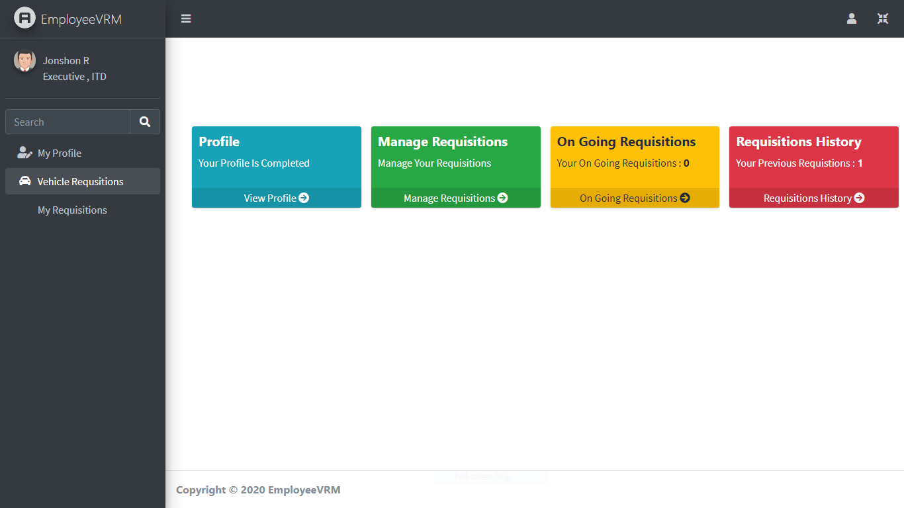
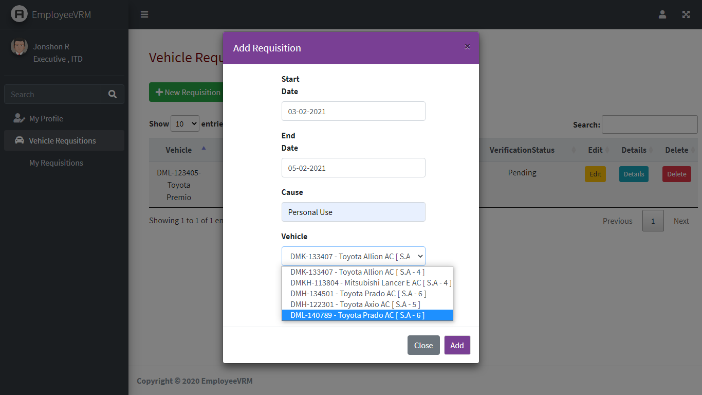
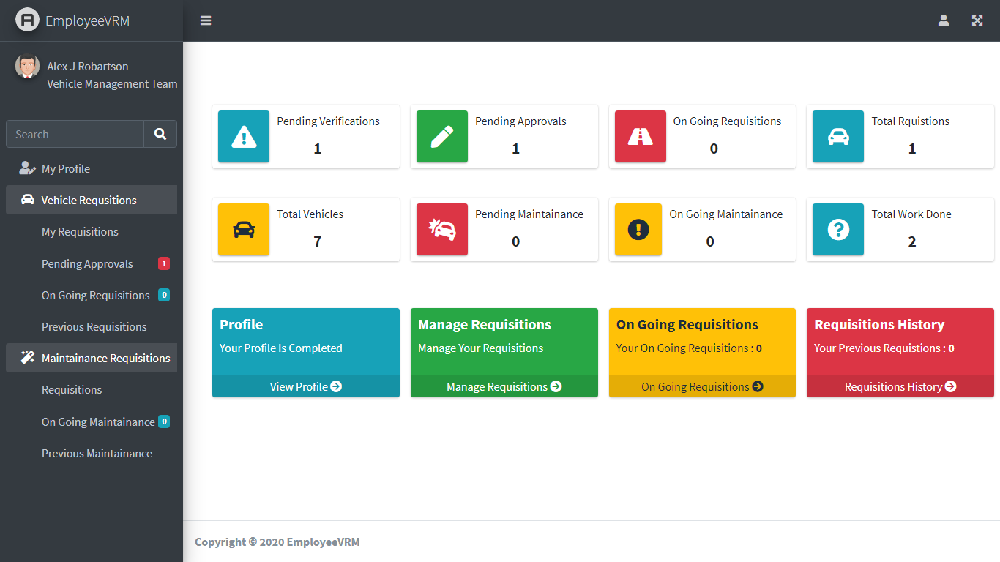
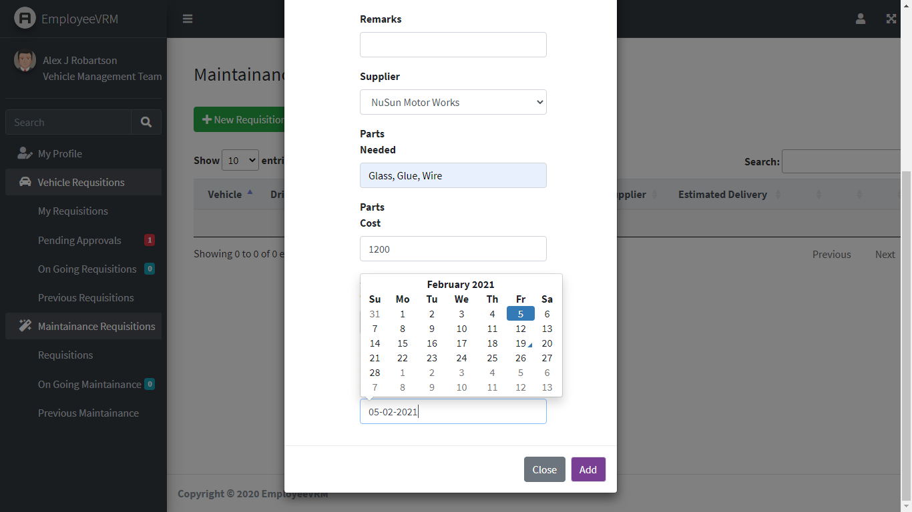
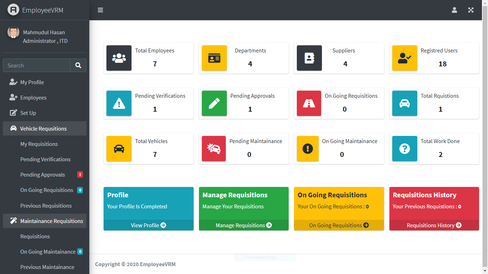

# EmployeeVRM
An office vehicle requisition and mainatainace system.
Developed using Asp.Net MVC 5. Html, CSS, BootStrap, JavaScript.
Used database MSSQL 2019.

                                                              
**Employee Dashboard**

**Employee Add Requistion**

**Department Manager Requistion Verification**

**Vehicle Management Team Dashboard**

**Vehicle Management Team Add Vehicle Maintainace**

**Admin Dashboard**

